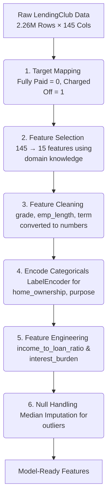
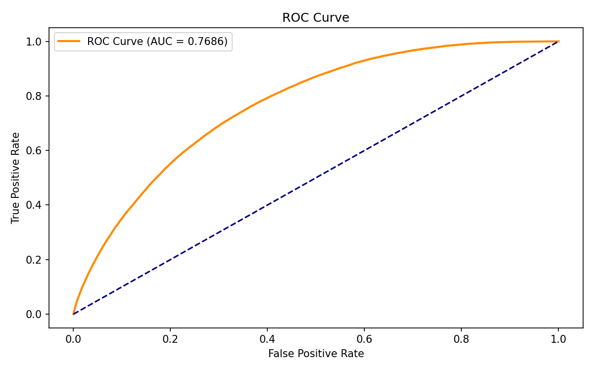
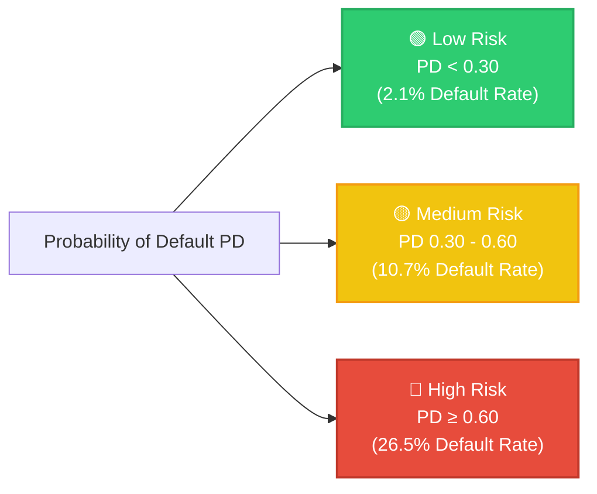
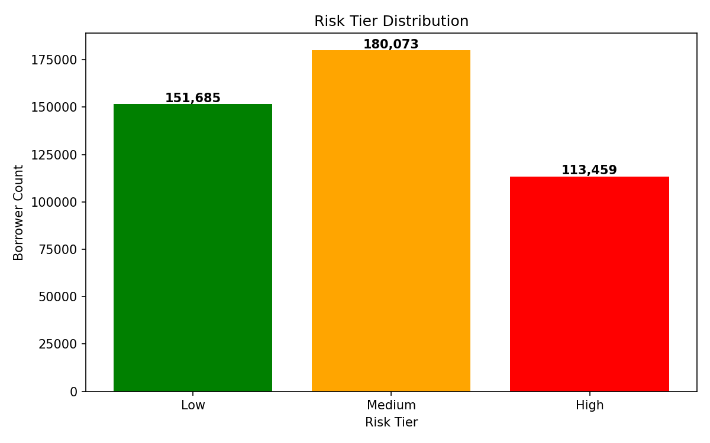
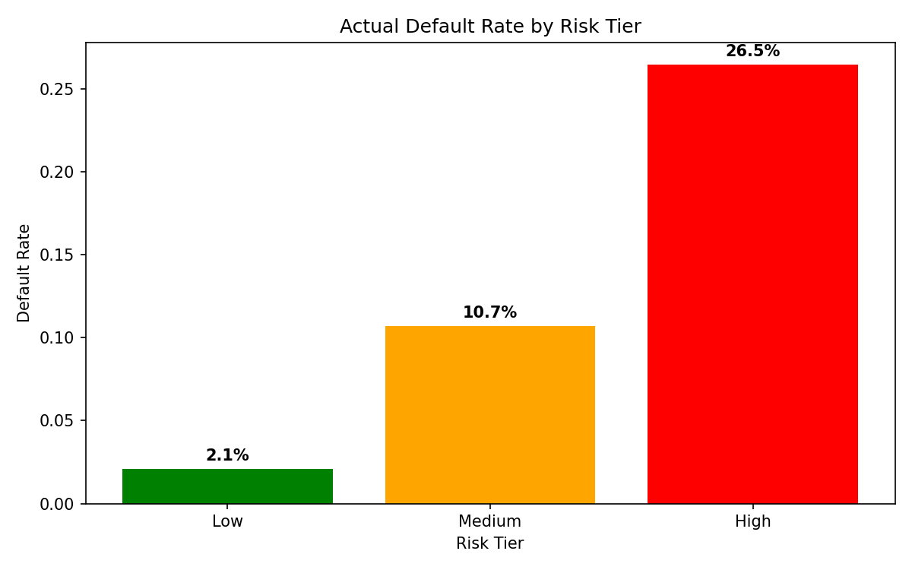
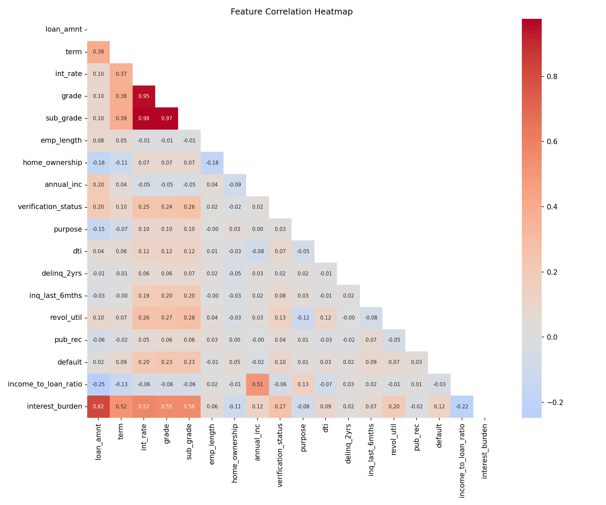
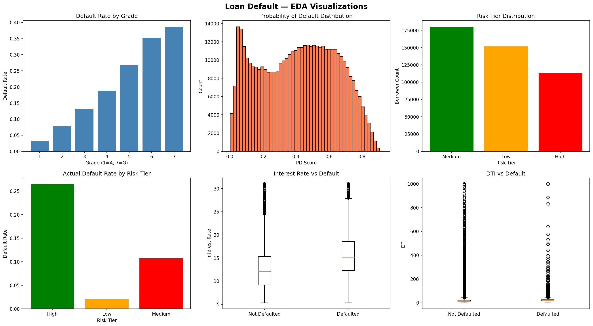
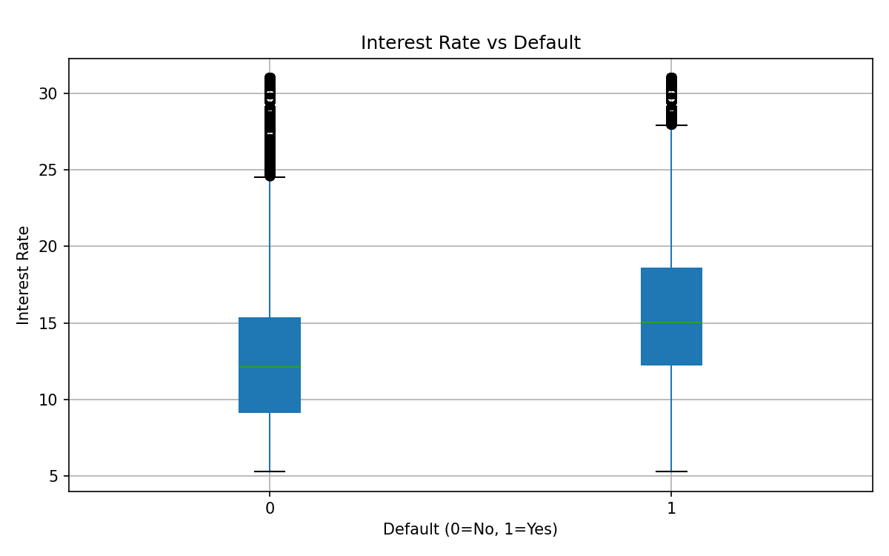
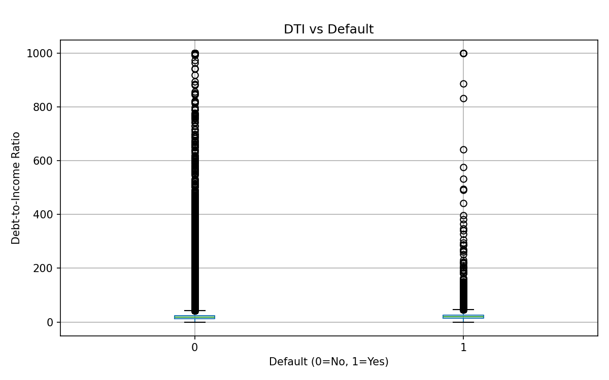

<div align="center">

# 🏦 RiskRadar
### Retail Loan Default Prediction & Risk Analytics System

[](https://github.com/SudhanshuBiswas01/HackRush_Hackhon_IITGN)

🏆 **Winner of HackRush 2026 Hackathon, IIT Gandhinagar** 🏆

<p align="center">
  <a href="https://github.com/SudhanshuBiswas01/HackRush_Hackhon_IITGN">
    
  </a>
  <a href="https://github.com/SudhanshuBiswas01/HackRush_Hackhon_IITGN">
    
  </a>
  <a href="https://github.com/SudhanshuBiswas01/HackRush_Hackhon_IITGN">
    
  </a>
  <a href="https://github.com/SudhanshuBiswas01/HackRush_Hackhon_IITGN">
    
  </a>
</p>

---

</div>

## 🎯 What This Project Does

Predicts the **Probability of Default (PD)** for LendingClub borrowers and buckets them into **Low / Medium / High** risk tiers — giving banks a scalable, explainable credit risk system.

*   ✅ Trained on **2,260,668** real loan records (2007–2018)
*   ✅ **12x** default rate difference between Low and High risk tiers
*   ✅ SHAP explainability — model reasoning aligns with real credit intuition
*   ✅ Engineered features that made it into the **top 6 SHAP contributors**

---

## 📊 Dataset Overview

| Property | Detail |
|:---|:---|
| 📂 **Source** | LendingClub Loan Dataset (Kaggle) |
| 📊 **Size** | 2,260,668 rows × 145 columns |
| 📅 **Period** | June 2007 – December 2018 |
| ⚠️ **Default Rate** | ~12% (severe class imbalance challenge) |
| 🔌 **Loaded via** | `kagglehub` API in Google Colab |

---

## ⚙️ Preprocessing Pipeline

Below is the workflow to go from raw messy data → model-ready features:



1.  **Target Mapping** — Fully Paid = `0`, Charged Off = `1`, ambiguous statuses dropped.
2.  **Feature Selection** — 145 → 15 features using domain knowledge + leakage removal.
3.  **Feature Cleaning** — Stripped `%` signs, converted text to numbers (`grade`, `emp_length`, `term`).
4.  **Encode Categoricals** — `LabelEncoder` on `sub_grade`, `home_ownership`, `purpose`, `verification_status`.
5.  **Feature Engineering** — Created 2 new features:
    *   `income_to_loan_ratio` = `annual_inc / (loan_amnt + 1)` → affordability signal.
    *   `interest_burden` = `int_rate × loan_amnt / 100` → total dollar cost of interest.
6.  **Null Handling** — Median imputation (robust to financial outliers).

---

## 🤖 Model — LightGBM

### Why LightGBM?
*   **Histogram-based** — handles 2.26M rows natively and fast.
*   **Built-in Class Weighting** — uses `scale_pos_weight` for class imbalance (`7.48`).
*   **Non-linear Relationships** — captures complex credit relationships automatically.
*   **SHAP Compatible** — supports full explainability natively.
*   **Industry Standard** — standard for credit risk scoring.

### Final Config
```python
model = lgb.LGBMClassifier(
    n_estimators=500,
    learning_rate=0.05,
    num_leaves=64,
    min_child_samples=50,
    scale_pos_weight=7.48,
    subsample=0.8,
    colsample_bytree=0.8,
    random_state=42,
    n_jobs=-1
)
```

> [!WARNING]
> **No early stopping** — early stopping silently killed minority class detection. Removing it was the fix that made everything work.

---

## 📈 Results

| Metric | Value |
|:---|:---|
| **AUC** | **0.7686** |
| **Optimal Threshold** | `0.61` |
| **F1 Score (defaults)** | `0.36` |
| **Precision (defaults)** | `0.27` |
| **Recall (defaults)** | `0.55` |

<p align="center">
  
</p>

Threshold found via `precision_recall_curve` — maximizes F1 on the minority class.

---

## 🎯 Risk Bucketing



| Tier | PD Score | Borrowers | Actual Default Rate |
|---|---|---|---|
| 🟢 **Low** | `< 0.30` | 151,685 | **2.1%** |
| 🟡 **Medium** | `0.30 – 0.60` | 180,073 | **10.7%** |
| 🔴 **High** | `≥ 0.60` | 113,459 | **26.5%** |

<p align="center">
  
  
</p>

**12x default rate gap between Low and High risk tiers.**

---

## 🔍 SHAP Explainability

Top features driving predictions:

| Rank | Feature | Direction | Impact Visualization |
|:---:|---|---|---|
| **1** | `sub_grade` | High → default ⬆️ | `██████████` (100%) |
| **2** | `int_rate` | High → default ⬆️ | `████████░░` (80%) |
| **3** | `grade` | Correlated with above | `██████░░░░` (60%) |
| **4** | `inq_last_6mths` | High → default ⬆️ | `████░░░░░░` (40%) |
| **5** | `home_ownership` | Renting → higher risk | `███░░░░░░░` (30%) |
| **6** | `income_to_loan_ratio` | High → safer ⬇️ | `██░░░░░░░░` (20%) |

> [!TIP]
> **Engineered Impact:** Our custom engineered feature `income_to_loan_ratio` ranked **#6** out of all features — proving that domain-driven feature engineering adds significant predictive signal.

---

## 💡 Recommendations

| Tier | Action |
|:---|:---|
| 🔴 **High** (PD ≥ 0.60) | Reject or reprice the loan |
| 🟡 **Medium** (0.30–0.60) | Flag for manual underwriter review |
| 🟢 **Low** (PD < 0.30) | Fast track approval |

👉 Use `income_to_loan_ratio` as a **mandatory screening filter** in the loan origination pipeline.

---

## 📊 Exploratory Data Analysis (EDA)

<details>
  <summary>🔍 Expand to View Data Distributions & Correlation Plots</summary>
  <br>
  
  ### Feature Correlation Matrix
  <p align="center">
    
  </p>

  ### Data Distributions
  <p align="center">
    
  </p>

  ### Specific Feature Relationships
  <p align="center">
    
    
  </p>
</details>

---

## 🗺️ The 36-Hour Journey

```
📊 Hour 00–06 ── ⏰ Dataset Loading (4 attempts, 2.26M rows)
🔧 Hour 06–12 ── ⚙️ Preprocessing (145 → 15 features)
🤖 Hour 12–20 ── 🧠 LightGBM Training (debugging early stopping)
✅ Hour 20–26 ── 📈 Model Working (AUC 0.7686, Risk Buckets)
🔍 Hour 26–32 ── 🔮 SHAP Explainability & EDA Plots
🚀 Hour 32–36 ── 📦 Reports, PPT & final Push
```

### Biggest Lessons
*   **Dataset loading took 4 attempts** — `kagglehub` API was the only thing that worked.
*   **Early stopping can silently destroy minority class detection** — removing it was the fix.
*   **Eval metric choice matters as much as the model** — `binary_logloss` doesn't care about minority class.
*   **Domain knowledge is critical** — leaky features would have made results meaningless.
*   **GitHub integration failed** — manual upload saved the day 😄.

---

## 🛠️ Tech Stack

| Tool / Library | Purpose |
|:---|:---|
| **Python** | Core programming language |
| **LightGBM** | Gradient boosted classification |
| **SHAP** | Model explainability & game theory interpretation |
| **pandas / numpy** | Data structures and array operations |
| **scikit-learn** | Preprocessing, pipeline helper & metrics |
| **matplotlib / seaborn** | Static visualizations |
| **Google Colab** | Cloud GPU/TPU training environment |
| **kagglehub** | API dataset loading |

---

## 🚀 Quick Start

```bash
# 1. Clone the repo
git clone https://github.com/SudhanshuBiswas01/HackRush_Hackhon_IITGN.git
cd HackRush_Hackhon_IITGN

# 2. Install dependencies
pip install lightgbm shap kagglehub pandas numpy scikit-learn matplotlib seaborn

# 3. Download dataset
python -c "import kagglehub; kagglehub.dataset_download('wordsforthewise/lending-club')"

# 4. Run the notebook
jupyter notebook loan_default_prediction.ipynb
```

---

## 📁 Project Structure

```
HackRush_Hackhon_IITGN/
│
├── loan_default_prediction.ipynb   # Main notebook
├── report/
│   └── risk_analytics_report.pdf   # Full PDF report
├── visuals/
│   └── *.png                       # EDA + SHAP plots
└── README.md
```

---

*Built with 💻 + ☕ + 0 hours of sleep at HackRush, IIT Gandhinagar*
